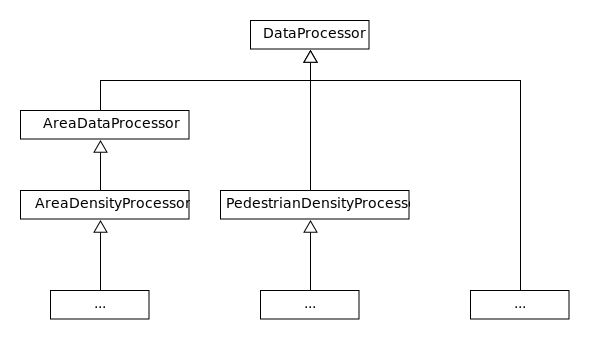

# Data processing API

## Usage

Every data is computed by a __data processor__, or simply called processor. A processor has to have a certain __key type__ (K) and a certain __value type__ (V). Only processors with the same key type can be put together into an __output file__. The processor's key type indicates the type of data computed.

There are already some predefined key classes:

 1. `TimestepDataKey`
 2. `PedestrianIdDataKey`
 3. `TimestepPedestrianIdDataKey`
 4. (`NoDataKey`)

__Example__: The class _PedestrianPositionProcessor_ is responsible for "computing" and storing the positions of each pedestrian at every point in time meaning that the corresponding key type is the _TimestepPedestrianIdDataKey_. So, the PedestrianPositionProcessor can be combined with other processors whose data is identified by the same key type (e.g. _PedestrianVelocityProcessor_). The value type is _VPoint_.

__Example__: The class _PedestrianEvacuationTimeProcessor_ computes the evacuation time for every pedestrian. A certain evacuation time can be associated with a pedestrian. So, the key type in this case is the _PedestrianIdDataKey_. The value type is _double_.

The key type _NoDataKey_ is constructed for scenario wide data with no specific identification needed (e.g. (mean) evacuation time). It can be viewed as a fake data key.

Every output file can only store processor data of exactly one key type, i.e. there is for example no possibility to store data from a PedestrianPositionProcessor and a PedestrianEvacuationTimeProcessor in one file.

For each key type, there exists a corresponding output file type:


The data processing's JSON structure is:
```json
{
    "files": [ {
        "type": (output file type),
        "filename": (filename),
        "processors": [ (processor ids) ],
        "separator": (separator's sign in output file, optional, default is space)
    }, ... ],
    "processors": [ {
        "type": (processor type),
        "id": (processor's id),
        "attributesType": (attributes' type, optional),
        "attributes": {
            (attribute name): (attribute name),
            ...
        } (optional)
    } ]
}
```

An example for a short data processing definition is:
```json
{
  "files": [ {
    "type": "org.vadere.simulator.projects.dataprocessing.outputfile.TimestepPedestrianIdOutputFile",
    "filename": "output_ts_pid.txt",
    "processors": [ 1, 2, 3 ],
    "separator": ";"
  } ],
  "processors": [ {
    "type": "org.vadere.simulator.projects.dataprocessing.processor.PedestrianPositionProcessor",
    "id": 1
  }, {
    "type": "org.vadere.simulator.projects.dataprocessing.processor.PedestrianVelocityProcessor",
    "id": 2,
    "attributesType": "org.vadere.state.attributes.processor.AttributesPedestrianVelocityProcessor",
    "attributes": {
      "pedestrianPositionProcessorId": 1
    }
  }, {
    "type": "org.vadere.simulator.projects.dataprocessing.processor.PedestrianDensityCountingProcessor",
    "id": 3,
    "attributesType": "org.vadere.state.attributes.processor.AttributesPedestrianDensityCountingProcessor",
    "attributes": {
      "pedestrianPositionProcessorId": 1,
      "radius": 1.5
    }
  } ]
}
```

As you can see in this example, there is a possibility to use a processor's data as source for a new computation. That means that data does not have to be computed multiple times. Here, the velocity processor uses positions from the positions processor to calculate the velocity.

The output file is saved in the projects' output' folder of the scenario run (with a timestamp), e.g. in _output/RiMEA-4_2016-09-12_12-36-40.341_.

## Creating a new data processor

There are two important base classes:

 1. OutputFile<K>
 2. DataProcessor<K,V>

Common functionality for every output file, and every processor respectively, is located in the corresponding abstract base class.

If you want to create a new processor, you have to inherit from the _DataProcessor_ base class and simultaneously specify the key (K) and value (V) type. Let's say, you want to count the amount of pedestrians currently located in the scenario. Since the amount of pedestrians is only timestep dependent, you have to choose the _TimestepDataKey_ as the suitable key type. The value type in this case is _int_. The class definition would look something like:

```java
class AmountPedestriansProcessor extends DataProcessor<TimestepDataKey, Integer> { ... }
```

You can override the significant methods from the base class:

```java
public void preLoop(SimulationState state) { }
protected abstract void doUpdate(SimulationState state);
public void postLoop(SimulationState state) { }
public abstract void init(ProcessorManager manager);
```

The _preLoop()_ and _postLoop()_ methods are called just before, respectively after, the simulation loop starts, respectively ends.

The most important method is _doUpdate()_. It is called in every timestep with the current simulation state as the argument. In this method, you have the possibility to update your data. Coming back to our example, an implementation of _doUpdate()_ can look like:

```java
protected abstract void doUpdate(final SimulationState state) {
    int timeStep = state.getStep();
    int amountPeds = state.getTopography().getElements(Pedestrian.class).size();

    this.setValue(new TimestepDataKey(timeStep), amountPeds);
}
```

The _init()_ method gets called when the scenario is loading its processors. It can be used for getting necessary attributes/parameters for the processor's computation or to get access to the _MainModel_. The corresponding attributes, defined in JSON, can be accessed via the _getAttributes()_ method of the base class. The _MainModel_ can be accessed by the _ProcessorManager.getModel()_ method. In the case of our example, there is no initialization needed, which results in an empty implementation. But in case of the velocity processor, a possible implementation can look like:

```java
class PedestrianVelocityProcessor extends DataProcessor<TimestepPedestrianIdDataKey, Double> {
    private PedestrianPositionProcessor pedPosProc;
    private int backSteps;
    ...
    @Override
    public void init(final ProcessorManager manager) {
        AttributesPedestrianVelocityProcessor attributes =
            (AttributesPedestrianVelocityProcessor) this.getAttributes();

        this.pedPosProc =
            (PedestrianPositionProcessor) manager.getProcessor(attributes.getPedestrianPositionProcessorId());
        this.backSteps = attributes.getBackSteps();
    }

    @Override
    public void doUpdate(final SimulationState state) {
        // use this.pedPosProc and this.backSteps for your computation
    }
    ...
}
```

The abstract base classes for creating new processors are by now:


The _AreaDataProcessor_ is a base class for processors which compute their data with respect to a specific measurement area. The specified area can be accessed by the _getMeasurementArea()_ method.

The _AreaDensityProcessor_ can be used as a base class for processors which compute densities inside a specified area. To get a concrete _AreaDensityProcessor_, you have to derive from this base class and call the _setAlgorithm(IAreaDensityAlgorithm alg)_ method for defining the computation to be used.

It is nearly the same with the _PedestrianDensityProcessor_ class. Here you have to specify an implementation of the _IPointDensityAlgorithm_ interface.
