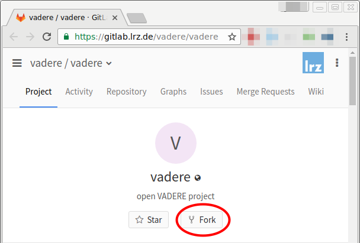

VADERE & Git
============

This document describes our workflows with Git.

## Excursus: Fundamentals of Git remotes

Like we can have multiple branches, we can also have multiple remotes.
Remotes are other repositories we are synchronizing with.

You are probably already familiar with remotes:
When you clone a repository, you have this repository as a remote.
By convention, it is called `origin`.

We use remotes to work with the public and the private VADERE repositories from
only *one* local repository.

Source: Scott Chacon and Ben Straub: [Pro Git](https://git-scm.com/book/en/v2),
specifically [Working with
Remotes in chapter 2](https://git-scm.com/book/en/v2/Git-Basics-Working-with-Remotes)

## Repository setup

Our repositories are set up as follows:

1. A public repository `vadere`.
2. A private repository `vadere-private`.

The public repository contains these branches:

1. `master` for the current stable release.
2. `develop` for current development.
3. `dev/*` or `lastname/*` branches.

For new releases, `develop` is merged into `master`.

The private repository contains only branches that must be private, e.g. a new
simulation model under development. It does not contain copies of any branches
of the public repository because this leads to a synchronization overhead.

Important: Both remote repositories are managed from one single local
repository using remotes. For details, see the workflows below.

The URLs for public and private repositories are:

* git@gitlab.lrz.de:vadere/vadere.git
* git@gitlab.lrz.de:vadere/vadere-private.git

To access the GitLab repositories it is good to use an SSH key.
GitHub explains the necessary steps on their
[help pages](https://help.github.com/articles/generating-an-ssh-key/).

## Workflows

### Getting started & public contribution

For standard development and bugfixes, you can follow this workflow.

First, fork the public repository:



```
git clone git@gitlab.lrz.de:YOURUSERNAME/vadere.git
cd vadere
git checkout origin/develop
git checkout -b my-feature
```

With this commands, you

1. make your initial clone of the public repository.
2. checkout the development branch on which we are working.
   (The `master` branch is reserved for stable releases.)
3. checkout a new branch (based on `develop`) to work on a new feature.

After you finished the new feature, go to GitLab, view your feature branch and create a pull/merge request.
The target branch must be `develop`, not `master`, in the official Vadere repository.


### Working on a private branch

To work on a private project, you can follow this workflow.

If not already done,

1. fork and clone the public repository (see above).
2. add the private repository as a remote: `git remote add private <url-of-private-repo>`

Now proceed with:

```
git checkout master
git checkout -b my-model
git push -u private my-model
```

With this commands, you

1. checkout the current release.
2. checkout a new branch (based on `master`) to work on e.g. a new model.
3. push your new branch to the private repository.

From now, you can synchronize your private branch with `git pull` and `git
push` with the private repository.

### Working together on a private branch

To work together on a private branch, you can follow this workflow.

Precondition: One person has set up a private branch (see previous section).

First, the co-worker has to do this steps (described in the previous section):

1. Fork and clone the public repository.
2. Add the private repository as a remote.

Now, the co-worker proceeds with:

```
git fetch --all
git checkout private/my-model
git checkout -b my-model
git push -u private my-model
```

With this commands, you

1. fetch the latest state of all repositories.
2. checkout the existing private branch of the remote `private`.
3. checkout your "working branch" with the same name but without the `private/` prefix.
4. initially push and register the branch.

From now, you can commit changes into this branch and synchronize with the
private repository using `git pull` and `git push`.

### Rebasing to avoid unnecessary merge commits

You may want to update your local branch you are currently working on and get
the latest changes of `master` or `develop`.

To avoid unnecessary merge commits you should prefer
[rebasing](https://git-scm.com/book/de/v1/Git-Branching-Rebasing) over merging.
Automatic merging happens when you do `git pull` and there are new commits
locally *and* remotely.
In this case it is usually better to do `git pull --rebase`. This applies your
local commits on top of the remote's commits.

Please configure Git to avoid merges on `git pull`:

```
# cd into your vadere repository, then
git config pull.ff only
```
